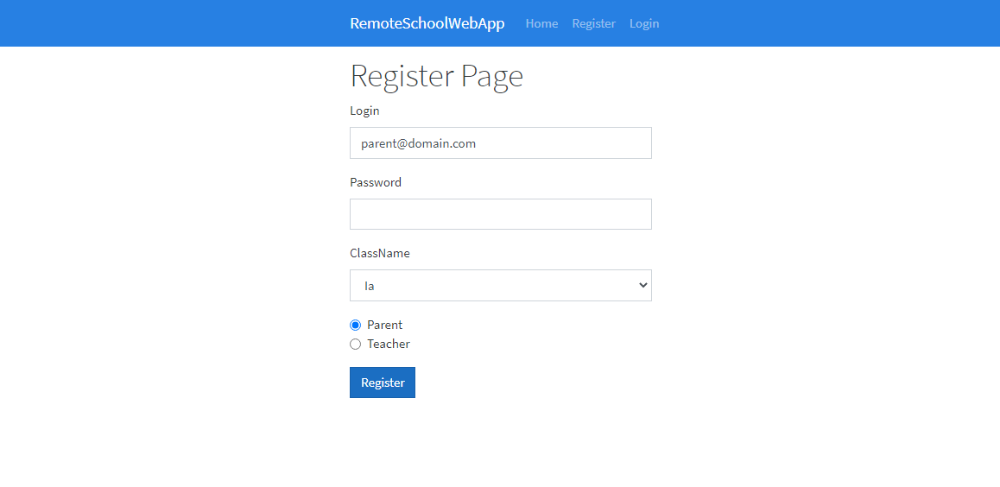
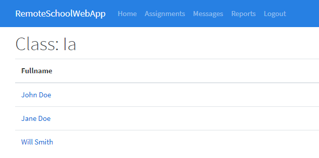
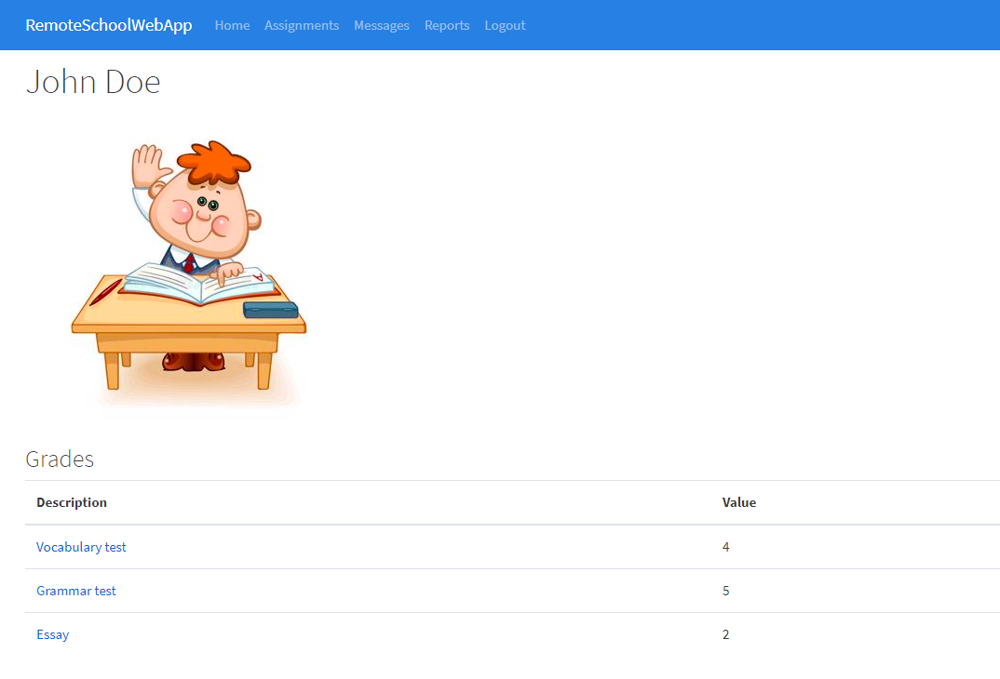
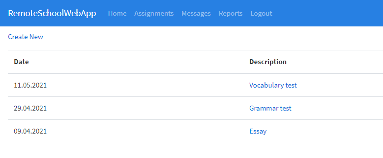
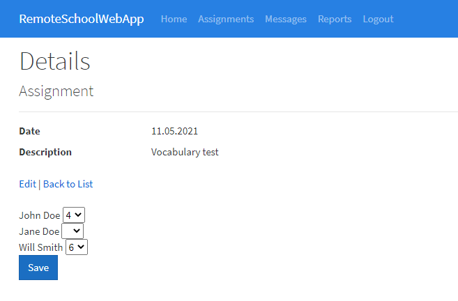
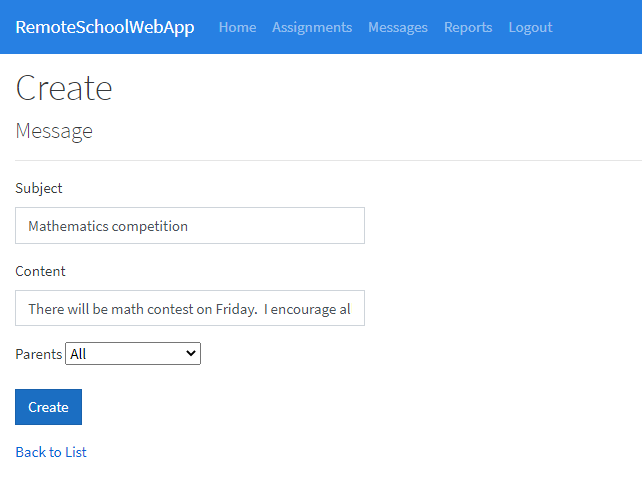
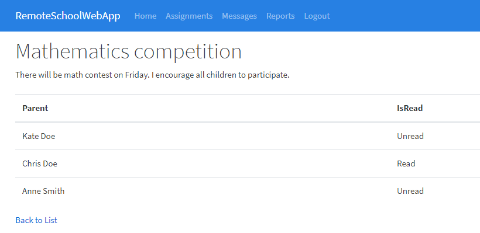
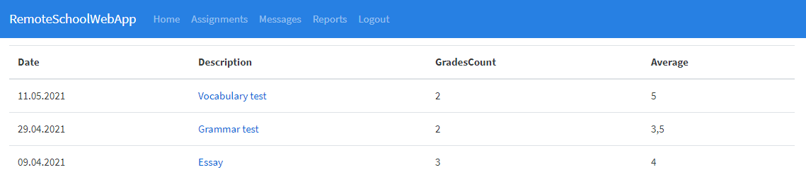
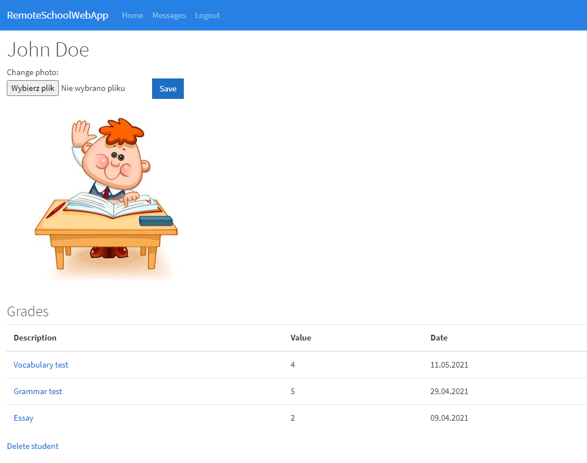
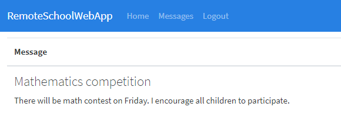

# RemoteSchoolWebApp
An app made to help parents and teachers communicate remotely.

# Roles
Users can create an account and choose the role - a parent or a teacher. To register, the user has to pick a class in which he teaches or his child attends to. There can be only one teacher in the class.

 

# Teacher
## Home
A teacher's home page represents a list of student in his class. 

 

Here he can pick one student and see all details, such as photo or grades.

 

## Assignments
The teacher can create assignments (past or planned ones) and give students grades for them. 

 

He can display a list of assignments and see the details of each one.

 

## Messages
The teacher can send a message to all parents or to a particular one. 

 

In the message's details, there is information on which parent has read the message.

## Reports
There are reports generated for every assignment made by the teacher. They show the number of grades and the average of all of them.

# Parent
## Home
A parent's home page represents the student's details. The parent can upload a photo, see the grades of his child or delete the student's data.

## Messages
There is a page where the parent can display all messages from a teacher in a list.

